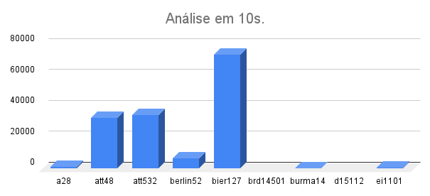
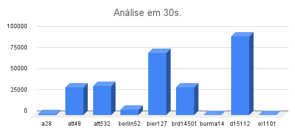
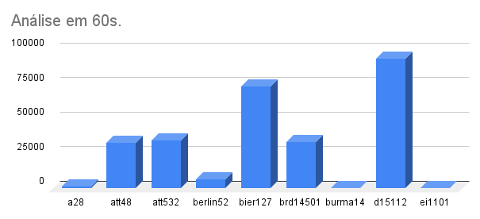

## Relatório - Trabalho Prático 3 (AED's III)

Alunos: 
- Gabriel Fracelino Nascimento (2021.1.08.030) 
- Gabriel Kusumota Nadalin (2021.1.08.007) 
- Gabriel Piva Pereira (2021.1.08.008)

### Objetivo
O problema apresentado se trata de uma leitura de um arquivo, em que cada linha apresenta as coordenadas de um vértice no plano cartesiano. Assim, com todos os vértices do arquivo e suas respectivas coordenadas, deve-se representar um grafo completo, em que todos os vértices estão ligados entre si e cada aresta possui o peso correspondente a distância entre os dois vértices, calculada pela fórmula da distância euclidiana. Com o grafo completo formado, deve-se apresentar uma (ou mais) Heurística Construtiva, e uma heurística de Busca Local, para buscar o maior subgrafo induzido de 5 vértices dentro do grafo completo. Para este problema, que será implementado em C++, utilizaremos a representação do grafo e subgrafo com classes e lista de adjacências.

### Abordagem
A abordagem utilizada para resolver o problema foi, inicialmente, salvar o número de linhas (ou número de vertices do grafo) na variável nVertices. Após isso, foi feita a leitura do arquivo, que foi salvo em uma matriz chamada matArquivo, que possui cada linha do arquivo como uma linha da matriz, e para cada linha, 2 colunas que representam as coordenadas X e Y do arquivo.
Foram utilizadas as classes Aresta (que possui os vértices que a formam (v1 e v2) e o peso) e Grafo (que possui o seu número de vértices e um vetor com todas as suas arestas, além de uma aresta específica, a que possuir maior peso, que será utilizada na Heurística Construtiva). Para o vetor de arestas, foi utilizada a classe vector do tipo Aresta. Tambem foi utilizada a classe Adjacencia, que representa uma adjacência de um vértice, com o vértice que faz a ligação e o peso, utilizada nas listas de Adjacência.

```cpp
class Adjacencia {
public:
    int v;
    int peso;
    ...
    bool operator < (const Adjacencia& a2) const {
		return (peso > a2.peso);
	}
};

class Aresta {
public:
    int v1;
    int v2;
    int peso;
    ...
};

class Grafo {
public:
    int nVertices;
    vector<Aresta> arestas;
    Aresta maior;
    ...
};
```
Na classe Adjacencia, foi feita uma sobrecarga de operador para ordenar as adjacências de um vértice específico da maior para a menor, utilizando o método sort, estratégia que será utilizada posteriormente.

Em todas as classes foram definidos seus respecivos construtores e métodos, que serão apresentados a seguir no relatório.

Na classe Grafo, é definida a função criarGrafoArquivo(), que utiliza o numero de vertices e a matriz arquivo definidos anteriormente para criar um objeto do tipo Grafo, com o numero de vertices e as arestas presentes no arquivo. Para cada nova aresta adicionada, ele compara com a aresta maior, e se o peso for superior, ela é salva como maior, assim no fim da criação do grafo, a maior Aresta dele será conhecida.

```cpp
// Classe Grafo
    Grafo criarGrafoArquivo(int nVertices, int **matArquivo) {
        Aresta maior(0, 0, 0);
        vector<Aresta> arestas;
        for(int i = 0; i < nVertices; i++) {
            for(int j = i+1; j < nVertices; j++) {
                Aresta a(i+1, j+1, calcularPeso(matArquivo[i][0], matArquivo[i][1], matArquivo[j][0], matArquivo[j][1]));
                arestas.push_back(a);
                if(a.peso > maior.peso) {
                    maior = a;
                }
            }
        }
        Grafo g(nVertices, arestas);
        g.maior = maior;
        return g;
    }
```
Com o grafo formado, também é criada sua representação em lista de adjacência, com uma função definida na classe Grafo, que é salva no vetor lAdj.

É utilizada uma outra classe, chamada Subgrafo, para representar um subgrafo buscado. Ela possui um vector de int's, representando os vértices que o subgrafo possui, um vector de arestas, e o peso somado. 

```cpp
class Subgrafo {
public:
    vector<int> vertices;
    vector<Aresta> arestas;
    int peso;
    ...
};
```
É na função subgrafo que são definidas as funções de Heurística Construtiva, e Busca Local, chamadas de _criarSubgrafoInicial()_ e _buscaLocal()_ respectivamente. A estratégia utilizada será aplicar uma vez a heurística construtiva e aplicar em um while dentro do tempo especificado, a busca local em cima do primeiro subgrafo formado várias vezes, buscando sempre o com maior peso até o tempo ser atingido.

#### Heurística Construtiva 
A heurística inicial definida, realizada na função _criarSubgrafoInicial()_, utilizada da maior aresta do grafo como ponto de partida. Ela adiciona os dois vértices (v1 e v2) que formam a maior aresta aos vértices do subgrafo e adiciona também a aresta ao vector de arestas. Com isso, utilizando a lista de adjacência do grafo, é realizada uma ordenação decrescente da lista dos dois vértices (v1 e v2), e para cada um deles, é adicionada a maior adjacência da lista (primeira aresta que já não tenha sido adicionada), adicionando os vértices (v3 e v4 diferentes) e formando e adicionando as arestas correspondentes. Assim, adicionando mais essas duas arestas, forma-se um subgrafo induzido de 4 vértices, e 3 arestas.
Para o último vértice, com o objetivo de maior variação, é realizado um sorteio de um vértice presente no grafo original, porém que não pertença ao subgrafo. Com este vértice (v5), é utilizada a lista de adjacência para comparar se a ligação de v5 é maior com v4 ou v3. Obtendo essa resposta, a maior dessas duas arestas é adicionada e v5 é adicionado ao subgrafo, formando assim o subgrafo incial de 5 vértices, com cada vértice com grau menor ou igual a 2 (árvore binária). 

```cpp
// Heuristica Construtiva
    void criarSubgrafoInicial(Grafo g, vector<Adjacencia> *lAdj) {
        int v1 = g.maior.v1;
        int v2 = g.maior.v2;
        int v3, v4;

        arestas.push_back(g.maior);
        vertices.push_back(v1);
        vertices.push_back(v2);

        sort(lAdj[v1].begin(), lAdj[v1].end());
        sort(lAdj[v2].begin(), lAdj[v2].end());

        for(Adjacencia x : lAdj[v1]) {
            if(x.v != v2) {
                Aresta a(v1, x.v, x.peso);
                arestas.push_back(a);
                vertices.push_back(x.v);
                v3 = x.v;
                break;   
            }
        }
        for(Adjacencia x : lAdj[v2]) {
            if(x.v != v1 && x.v != v3) {
                Aresta b(v2, x.v, x.peso);
                arestas.push_back(b);
                vertices.push_back(x.v);
                v4 = x.v;
                break;   
            }
        }

        int v5 = nAleatorio(g.nVertices);
        while (v5 == v1 || v5 == v2 || v5 == v3 || v5 == v4) {
            v5 = nAleatorio(g.nVertices);
        }

        int indiceV3 = v3-1;
        int indiceV4 = v4-1;

        if(v3 > v5) {
            indiceV3--;
        }
        if(v4 > v5) {
            indiceV4--;
        }

        if(lAdj[v5].at(indiceV3).peso > lAdj[v5].at(indiceV4).peso) {
            Aresta c(lAdj[v5].at(indiceV3).v, v5, lAdj[v5].at(indiceV3).peso);
            arestas.push_back(c);
        } else {
            Aresta c(lAdj[v5].at(indiceV4).v, v5, lAdj[v5].at(indiceV4).peso);
            arestas.push_back(c);
        }
        vertices.push_back(v5);
        
        peso = 0;
        for(Aresta a : arestas) {
            peso += a.peso;
        }
    }
```
```
// Pseudo-Código
    criarSubgrafoInicial(Grafo g, lAdj) inicio
        v1 <- g.maior.v1
        v2 <- g.maior.v2
        v3, v4

        arestas.adiciona(g.maior)
        vertices.adiciona(v1)
        vertices.adiciona(v2)

        ordenarD(lAdj[v1])
        ordenarD(lAdj[v2])

        para cada Adjacencia x em lAdj[v1]) faca
            se x.v != v2 entao
                Aresta a(v1, x.v, x.peso)
                arestas.adiciona(a);
                vertices.adiciona(x.v);
                v3 = x.v 
            fimse
        fimpara
        para cada Adjacencia x em lAdj[v2] faca
            se x.v != v1 E x.v != v3 entao
                Aresta b(v2, x.v, x.peso)
                arestas.adiciona(b)
                vertices.adiciona(x.v)
                v4 = x.v   
            fimse
        fimpara

        v5 <- verticeAleatorio
        enquanto v5 == v1 OU v5 == v2 OU v5 == v3 OU v5 == v4 faca
            v5 <- verticeAleatorio
        fimeanquanto

        se (lAdj[V5] com V3).peso > (lAdj[V5] com V4).peso entao
            Aresta c((lAdj[V5] com V3).v, v5, (lAdj[V5] com V3).peso)
            arestas.adiciona(c);
        senao entao
            Aresta c((lAdj[V5] com V4).v, v5, (lAdj[V5] com V4).peso)
            arestas.adiciona(c)
        fimse
        vertices.adiciona(v5)
        
        peso <- 0;
        para cada Aresta a em arestas faca
            peso <- peso + a.peso;
        fimpara
    fim
```

Com o subgrafo incial formado, é realizada a chamada da busca local várias vezes em sequência, até o tempo limite.

#### Busca Local
A estratégia criada para a busca local se trata de, com o subgrafo formado na primeira etapa, relizar o sorteio um vertice que não está presente no subgrafo ou que já não foi testado, e com ele, verificar se existe algum subgrafo com peso maior ao já encontrado ao substituir esse subgrafo sorteado por algum dos 5 já presentes. Se existir algum subgrafo maior, os vértices são trocados e um novo subgrafo com peso maior é formado e retornado. A comparação do novo vértice ocorre com todos os 5 presentes, e se o vértice v1 faz duas ligações, por exemplo, com v2 e v3, é utilizado a lista de adjacência para comparar a soma dos pesos dessas adjacências com as adjacências do novo vértico com v2 e v3, e assim comparado qual soma tem maior valor. 
Se deveria ocorrer uma troca de vértices, o vértice que sai é retirado do vector de vértices, substituido pelo novo vértice e suas arestas são removidas e substituídas pelas novas arestas e consequentemente o peso é atualizado.

```cpp
// Busca Local
    Subgrafo buscaLocal(bool *verticesUtilizados, int *nVerticesUtilizados, Grafo g, vector<Adjacencia> *adj) {
        Subgrafo s = *this;

        if(nVerticesUtilizados[0] >= g.nVertices) {
            return s;
        }
        nVerticesUtilizados[0]++;

        // Define um novo vertice para adicionar, que não tenha sido adicionado
        int novoV = nAleatorio(g.nVertices);
        while (verticesUtilizados[novoV-1]) {
            novoV = nAleatorio(g.nVertices);
        }
        verticesUtilizados[novoV-1] = true;

        vector<Adjacencia> *adjSub = criarListaAdj(g.nVertices);

        for(int v : s.vertices) {
            int somaV = 0;
            int somaNovoV = 0;
            vector<Adjacencia> adjacenciasNovoV;
            for(Adjacencia a : adjSub[v]) {
                somaV += a.peso;
                int indice = a.v-1;
                if(a.v > novoV) {
                    indice--;
                }
                somaNovoV += adj[novoV].at(indice).peso;
                adjacenciasNovoV.push_back(adj[novoV].at(indice));
            }
            if(somaV < somaNovoV) {
                for(int j = 0; j < s.vertices.size(); j++) {
                    if(s.vertices.at(j) == v) {
                        s.vertices.at(j) = novoV;
                        break;
                    }
                }
                for(int i = 0; i < s.arestas.size(); i++) {
                    if(s.arestas.at(i).v1 == v) {
                        s.arestas.at(i).v1 = novoV;
                        for(Adjacencia d : adjacenciasNovoV) {
                            if(d.v == s.arestas.at(i).v2) {
                                s.peso -= s.arestas.at(i).peso;
                                s.peso += d.peso;
                                s.arestas.at(i).peso = d.peso;
                                break;
                            }
                        }
                    } else if(s.arestas.at(i).v2 == v) {
                        s.arestas.at(i).v2 = novoV;
                        for(Adjacencia d : adjacenciasNovoV) {
                            if(d.v == s.arestas.at(i).v1) {
                                s.peso -= s.arestas.at(i).peso;
                                s.peso += d.peso;
                                s.arestas.at(i).peso = d.peso;
                                break;
                            }
                        }
                    }
                }
            }
        }
        return s;
    }
```
```
// Psudo-Código
    Subgrafo buscaLocal(verticesUtilizados, nVerticesUtilizados, Grafo g, adj) inicio
        Subgrafo s <- this

        se nVerticesUtilizados >= g.nVertices) entao
            retorna s
        fimse
        
        nVerticesUtilizados <- nVerticesUtilizados + 1

        novoV <- verticeAleatorio
        enquanto verticesUtilizados[novoV-1] == VERDADEIRO
            novoV <- verticeAleatorio
        fim enquanto
        verticesUtilizados[novoV-1] <- VERDADEIRO

        adjSub <- criarListaAdj(g.nVertices)

        para cada v em s.vertices faca
            somaV <- 0
            somaNovoV <- 0
            vadjacenciasNovoV
            para cada Adjacencia a em adjSub[v] faca
                somaV <- somaV + a.peso;
                somaNovoV <- somaNovoV + (adj[novoV] com a.v).peso
                adjacenciasNovoV.adiciona(adj[novoV] com a.v)
            fimpara
            se somaV < somaNovoV entao
                para j <- 0 até s.vertices.tamanho faca
                    se s.vertices[j] == v entao
                        s.vertices[j] <- novoV
                    fimse
                fimpara
                para i <- 0 até s.arestas.tamanho faca
                    se s.arestas[i].v1 == v entao
                        s.arestas[i].v1 <- novoV
                        para cada Adjacencia d em adjacenciasNovoV faca
                            se d.v == s.arestas[i].v2 entao
                                s.peso <- s.peso - s.arestas[i].peso
                                s.peso <- s.peso + d.peso
                                s.arestas[i].peso <- d.peso
                            fimse
                        fimpara
                    senao se s.arestas[i].v2 == v entao
                        s.arestas[i].v2 <- novoV
                        para cada Adjacencia d em adjacenciasNovoV faca
                            se d.v == s.arestas[i].v1 entao
                                s.peso <- s.peso - s.arestas[i].peso
                                s.peso <- s.peso + d.peso
                                s.arestas[i].peso <- d.peso
                            fimse
                        fimpara
                    fimse
                fimpara
            fimse
        fimpara
        retorna s
    fim
```
#### Tempo de Execução
Para realizar a parada nos tempos especificados, utilizamos a biblioteca [ctime](https://cplusplus.com/reference/ctime/) com a função time. Assim, o tempo é capturado no início do main, e depois ao final da primeira heurística. Se o tempo for inferior ao especificado (10, 30 ou 60), o código executa um while aplicando a busca local e capturando o tempo após cada loop. Se o tempo ainda for suficiente, ele executa novamente a busca até superar o tempo limite. 

### Respostas
Os dados apresentados na execução do código com cada um dos arquivos solicitados, em cada tempo executado.

#### 10 segundos
Obs: Os arquivos brd14501 e d15112 não executam a heurística construtiva inicial em menos de 10 segundos, logo não será adicionado a resposta nessa etapa para ambos.

```
arc/a28.txt
1 96 78 2 95 
1187
```
```
arc/att48.txt
4 17 19 35 45 
32846
```
```
arc/att532.txt
1 489 472 2 10 
34739
```
```
arc/berlin52.txt
2 52 11 7 42 
6621
```
```
arc/bier127.txt
98 99 104 101 107 
73461
```
```
arc/brd14501.txt
```
```
arc/burma14.txt
5 10 1 4 6 
35
```
```
arc/d15112.txt
```
```
arc/eil101.txt
38 65 35 43 86 
332
```



#### 30 segundos
```
arc/a28.txt
1 96 78 2 95 
1187
```
```
arc/att48.txt
4 17 19 35 45 
32846
```
```
arc/att532.txt
1 489 472 2 10 
34739
```
```
arc/berlin52.txt
2 52 11 7 42 
6621
```
```
arc/bier127.txt
98 99 104 101 107 
73461
```
```
arc/brd14501.txt
5436 13865 13862 5227 11479 
32909
```
```
arc/burma14.txt
5 10 1 4 6 
35
```
```
arc/d15112.txt
4488 10576 7954 14110 42 
93337
```
```
arc/eil101.txt
38 65 35 43 86 
332
```



#### 60 segundos
```
arc/a28.txt
1 96 78 2 95 
1187
```
```
arc/att48.txt
4 17 19 35 45 
32846
```
```
arc/att532.txt
1 489 472 2 10 
34739
```
```
arc/berlin52.txt
2 52 11 7 42 
6621
```
```
arc/bier127.txt
98 99 104 101 107 
73461
```
```
arc/brd14501.txt
5436 13865 13862 5227 2996 
33336
```
```
arc/burma14.txt
5 10 1 4 6 
35
```
```
arc/d15112.txt
4488 10576 7954 14110 5437 
93476
```
```
arc/eil101.txt
38 65 35 43 86 
332
```



### Conclusão
A maior dificuldade encontrada para o problema foi pensar nas Heurísticas aplicadas. A Busca Local, por exemplo, no fato de trocar um vértice por outro, e todas as verificações e trocas que isso ocasiona, ou na Heurística Construtiva inicial, ao utilizar as listas de Adjacência para encontrar as arestas correspondentes para formar o vértice.
Com ambos os códigos aplicados, obtemos um resultado para a maioria das instâncias, mas idealmente seria necessário buscar outras estratégias e heurísticas, trocando 2 ou 3 vértices de uma vez na busca local, por exemplo, para obter cada vez mais resultados melhores.
Além disso, outra dificuldade encontrada foi a questão do tempo de execução, fazendo o código executar e parar após o tempo limite.
